# 🪵 Olinda Aguiar — Artes em Madeira

> Ateliê de marcenaria artística, esculturas e peças de design autoral em madeira nobre, ambientado em um casarão histórico colonial.

[](./docs/diretrizes_documentacao.md)
[](./docs/diretrizes_documentacao.md)
[](./.github/workflows/automatizar_issues.yml)

---

## 🏛️ Sobre o Projeto

O repositório **Olinda Aguiar — Artes em Madeira** (`git@github.com:fvier/olindaaguiartemadeira.git`) abriga a infraestrutura digital, catálogo de obras, vitrine interativa e documentação de governança do ateliê. 

A identidade do projeto funde a nobreza da marcenaria artesanal brasileira à arquitetura colonial (coral terracota, azul cobalto, vermelho colonial e acabamentos quentes de madeira).

---

## 🗺️ Mapa de Navegação da Documentação

```mermaid
flowchart TD
    ROOT["README.md (Painel Principal)"]
    
    subgraph GOV["📚 Governança & Padrões (docs/)"]
        DIRETRIZES["diretrizes_documentacao.md<br/>• Regras editoriais<br/>• Git Graph CLI & Mermaid<br/>• Registro de ADRs"]
        ESTRATEGIA["estrategia_execucao.md<br/>• Branches & Conventional Commits<br/>• Fluxo de Pull Requests"]
        PROMPT_IA["prompt_ia.md<br/>• Contexto permanente para IAs<br/>• Identidade de marca e regras"]
        MIGRATION["migration_guide.md<br/>• Onboarding e clone do repositório"]
        BACKUP["politica_backup.md<br/>• Política 3-2-1 e ativos visuais"]
        PLANO["plano_personalizacao.md<br/>• Roadmap e expansão"]
        POSTMORTEM["postmortem.md<br/>• Registro incremental de incidentes"]
        TROUBLESHOOTING["troubleshooting.md<br/>• Diagnósticos e soluções"]
        INFRA["ajuda_infra.md<br/>• Comandos rápidos e infraestrutura"]
    end

    subgraph CI["⚙️ Automação (.github/)"]
        ACTIONS["workflows/automatizar_issues.yml<br/>• Criação idempotente de Issues"]
    end

    subgraph ASSETS["🎨 Ativos & Identidade"]
        REFS["referencias/<br/>• Logotipos e fotos da fachada"]
    end

    ROOT --> DIRETRIZES
    ROOT --> ESTRATEGIA
    ROOT --> PROMPT_IA
    ROOT --> MIGRATION
    ROOT --> BACKUP
    ROOT --> PLANO
    ROOT --> POSTMORTEM
    ROOT --> TROUBLESHOOTING
    ROOT --> INFRA
    ROOT --> ACTIONS
    ROOT --> REFS
```



---

## 📁 Estrutura do Repositório

```text
olindaaguiartemadeira/
├── README.md                          # Painel principal com mapa visual Mermaid e índice
├── .gitignore                         # Sanitização e exclusão de arquivos temporários
├── .github/
│   └── workflows/
│       └── automatizar_issues.yml     # Workflow de automação de Issues idempotente
├── docs/                              # Governança, infraestrutura e sustentação do repositório
│   ├── diretrizes_documentacao.md     # Regras editoriais, Git Graph e ADRs
│   ├── estrategia_execucao.md         # Estratégia Git, branches e contribuição
│   ├── migration_guide.md             # Guia de clonagem e onboarding em novas máquinas
│   ├── ajuda_infra.md                 # Arquitetura e comandos rápidos
│   ├── postmortem.md                  # Registro incremental de incidentes e lições aprendidas
│   ├── troubleshooting.md             # Solução de problemas comuns
│   ├── politica_backup.md             # Política de backup 3-2-1 e sincronização offsite
│   ├── plano_personalizacao.md        # Roteiro de expansão de módulos e catálogo
│   └── prompt_ia.md                   # Contexto permanente para assistentes de IA
└── referencias/                       # Ativos de identidade visual, logotipos e fachada colonial
```

---

## 🚀 Guia Rápido

### 1. Clonar o Repositório
```bash
git clone git@github.com:fvier/olindaaguiartemadeira.git
cd olindaaguiartemadeira
```

### 2. Visualização Gráfica do Git
Para acompanhar branches e commits visualmente no terminal:
```bash
git graph
```

---

## 🔒 Segurança & Governança

- Siga a **Regra da Alimentação Incremental (Não-Substituição)** para manter o histórico íntegro em [docs/postmortem.md](./docs/postmortem.md) e [docs/troubleshooting.md](./docs/troubleshooting.md).
- Nunca inclua arquivos `.env` ou chaves de produção no Git.
