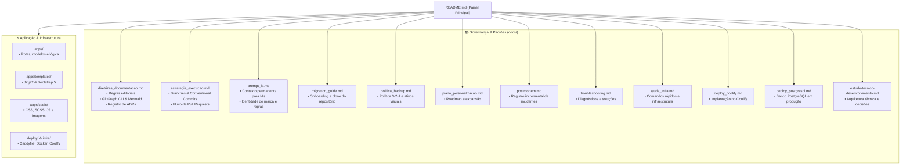

# 🪵 Olinda Aguiar — Artes em Madeira

> Ateliê de marcenaria artística, esculturas e peças de design autoral em madeira nobre, ambientado em um casarão histórico colonial.

[](./requirements.txt)
[](./requirements.txt)
[](./apps/templates)
[](./Dockerfile)
[](./docs/diretrizes_documentacao.md)
[](./docs/diretrizes_documentacao.md)
[](./.github/workflows/automatizar_issues.yml)

---

## 🏛️ Sobre o Projeto

O repositório **Olinda Aguiar — Artes em Madeira** (`git@github.com:fvier/olindaaguiartemadeira.git`) abriga a infraestrutura digital, catálogo de obras, vitrine interativa e documentação de governança do ateliê. 

A aplicação une a nobreza da marcenaria artesanal brasileira à arquitetura colonial (coral terracota, azul cobalto, vermelho colonial e acabamentos quentes de madeira), com backend robusto em Flask, suporte a Docker, Coolify e banco PostgreSQL/SQLite.

---

## 🗺️ Mapa de Navegação da Documentação



---

## 📁 Estrutura do Repositório

```text
olindaaguiartemadeira/
├── README.md                          # Painel principal com mapa visual Mermaid e índice
├── .gitignore                         # Sanitização e exclusão de arquivos temporários
├── .github/
│   └── workflows/
│       └── automatizar_issues.yml     # Workflow de automação de Issues idempotente
├── apps/                              # Núcleo da aplicação Flask
│   ├── __init__.py                    # Factory, extensões e registro de Blueprints
│   ├── config.py                      # Configurações de ambiente (Debug, Production)
│   ├── pages/                         # Rotas (routes.py) e modelos (models.py)
│   ├── static/                        # CSS, SCSS, JavaScript, fontes e imagens
│   └── templates/                     # Layouts, páginas e componentes Jinja2
├── deploy/                            # Scripts de deploy em VPS e configuração do Caddy
├── docs/                              # Governança, infraestrutura e sustentação do repositório
│   ├── diretrizes_documentacao.md     # Regras editoriais, Git Graph e ADRs
│   ├── estrategia_execucao.md         # Estratégia Git, branches e contribuição
│   ├── migration_guide.md             # Guia de clonagem e onboarding em novas máquinas
│   ├── ajuda_infra.md                 # Arquitetura e comandos rápidos
│   ├── deploy_coolify.md              # Implantação automatizada no Coolify
│   ├── deploy_postgresql.md           # Configuração de PostgreSQL
│   ├── estudo-tecnico-desenvolvimento.md # Arquitetura técnica detalhada
│   ├── postmortem.md                  # Registro incremental de incidentes e lições aprendidas
│   ├── troubleshooting.md             # Solução de problemas comuns
│   ├── politica_backup.md             # Política de backup 3-2-1 e sincronização offsite
│   ├── plano_personalizacao.md        # Roteiro de expansão de módulos e catálogo
│   └── prompt_ia.md                   # Contexto permanente para assistentes de IA
├── infra/                             # Arquivos de infraestrutura (Coolify / Terraform)
├── migrations/                        # Migrações de banco de dados (Alembic / Flask-Migrate)
├── referencias/                       # Ativos de identidade visual, logotipos e fachada colonial
├── scripts/                           # Scripts utilitários e automações
├── tests/                             # Bateria de testes automatizados
├── Dockerfile                         # Containerização Docker multi-stage
├── docker-compose.yml                 # Orquestração local com PostgreSQL
├── docker-compose.coolify.yml         # Configuração para deploy no Coolify
├── gunicorn-cfg.py                    # Servidor WSGI para produção
├── requirements.txt                   # Dependências Python
└── run.py                             # Ponto de entrada da aplicação
```

---

## 🚀 Execução Local

### Pré-requisitos
- Python 3.10+
- `pip` e `virtualenv`

### Passo a Passo

```bash
# 1. Clonar repositório
git clone git@github.com:fvier/olindaaguiartemadeira.git
cd olindaaguiartemadeira

# 2. Criar e ativar ambiente virtual
python3 -m venv venv
source venv/bin/activate

# 3. Instalar dependências
pip install -r requirements.txt

# 4. Configurar variáveis de ambiente
cp .env.example .env

# 5. Inicializar banco e executar aplicação
python3 run.py
```

Acesse em seu navegador: `http://127.0.0.1:5000`

### Criação de Usuário Administrador
```bash
python3 create_user.py
```

---

## 🐳 Execução com Docker

```bash
# Subir com docker-compose (Aplicação + PostgreSQL):
docker-compose up -d --build

# Ver logs:
docker-compose logs -f
```

---

## 📊 Visualização Gráfica do Git

Para acompanhar a árvore de commits e branches no terminal com o alias oficial:
```bash
git graph
```

---

## 🔒 Segurança & Governança

- Siga a **Regra da Alimentação Incremental (Não-Substituição)** para manter o histórico íntegro em [docs/postmortem.md](./docs/postmortem.md) e [docs/troubleshooting.md](./docs/troubleshooting.md).
- Nunca inclua arquivos `.env`, chaves privadas ou senhas reais no Git.
