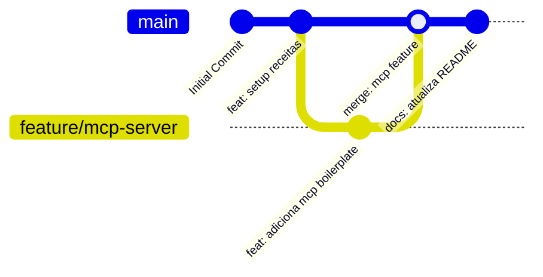

# 📖 Diretrizes de Documentação & Governança (Receitas de IA & Infraestrutura)

Este documento define as normas, princípios e padrões operacionais para a criação, manutenção e evolução da documentação, automações e receitas do repositório **Receitas**.

---

## 1. Objetivos da Documentação

- **Preservação de Conhecimento**: Evitar a perda de padrões, scripts e prompts valiosos acumulados ao longo do tempo na criação de novos produtos.
- **Portabilidade & Reuso**: Garantir que qualquer desenvolvedor possa copiar e colar receitas para novos projetos reais (SaaS, apps, microserviços) com zero atrito de configuração.
- **Segurança por Padrão**: Impedir a exposição involuntária de senhas, tokens ou webhooks reais.

---

## 2. Padrão de Tom de Voz: Modelo Híbrido

Adotamos o **Modelo Híbrido de Escrita (Corporativo Amigável)**:

- **Seções Conceituais / Introdução**: Usar tom acolhedor, contextual e empático. Explicar o "porquê" de cada receita ou padrão existir.
- **Passo a Passo / Procedimentos**: Usar tom direto, procedimental e altamente escaneável (listas numeradas, negritos em botões e tabelas).

---

## 3. Automação Idempotente de Issues via GitHub Actions

No repositório `fvier/olindaaguiartemadeira`, as tarefas principais e melhorias futuras são cadastradas automaticamente no GitHub via o workflow `.github/workflows/automatizar_issues.yml`.

### Como Funciona a Automação:
1. **Gatilho**: Disparado em todo `push` para a branch `main` e via acionamento manual (`workflow_dispatch`).
2. **Ambiente & Autenticação**: Executado em `ubuntu-latest` utilizando a variável `GH_TOKEN: ${{ secrets.GITHUB_TOKEN }}`.
3. **Idempotência (`create_issue_if_not_exists`)**:
   Antes de criar qualquer tarefa, o script executa uma consulta usando o GitHub CLI (`gh issue list --search "\"$title\" in:title"`). Se a issue já existir, a criação é omitida, evitando duplicações em commits consecutivos.
4. **Estrutura das Issues**:
   - Título com identificador claro (`[FEAT]`, `[CONFIG]`, `[ARCH]`, `[BUG]`, `[DOCS]`).
   - Rótulos adequados (`enhancement`, `documentation`, `bug`).
   - Descrição rica com links relativos para `docs/` e caixa de verificação para Critérios de Aceite (`- [ ]`).

---

## 4. Visualização Gráfica de Branches e Histórico (Git Graph)

Para manter a transparência, rastreabilidade e facilitar o entendimento visual das branches do repositório por toda a equipe, padronizamos dois métodos de visualização gráfica do Git:

### A. Visualização Gráfica via Terminal (Git Graph CLI)
Execute o comando abaixo ou configure o alias oficial no seu Git:

```bash
# Comando direto no terminal:
git log --graph --oneline --all --decorate

# Criar alias permanente 'git graph':
git config --global alias.graph "log --graph --oneline --all --decorate"

# Uso diário:
git graph
```

Exemplo do output no terminal:
```text
* 7e98698 (HEAD -> main, origin/main) feat: integra novo contexto de automacao idempotente de issues
* 5302250 ci: adiciona workflow de automacao de criacao de issues no github via github cli
| * 170a304 (feature/nova-receita) feat: adiciona rclone backup
|/  
* 8f013ac feat: consolida meta_prompt_documentacao.md como prompt mestre definitivo
```

### B. Diagrama de Branches em Markdown (Mermaid gitGraph)
Nos arquivos de documentação (`README.md`, `estrategia_execucao.md`), utilize blocos `mermaid` com sintaxe `gitGraph` para ilustrar o fluxo de branches:



### C. Extensão Recomendada para IDEs (VS Code / Antigravity)
Recomendamos a utilização da extensão **Git Graph** (`mhutchie.git-graph`) no VS Code / IDE para navegar visualmente pelas branches, commits, stashes e diffs com um clique.

---

## 5. Estrutura Oficial do Repositório

```text
Receitas/
├── README.md                          # Painel principal com mapa visual Mermaid e índice
├── .github/
│   └── workflows/
│       └── automatizar_issues.yml     # Workflow de automação de Issues idempotente
├── docs/                              # Governança, infraestrutura e sustentação do repositório
│   ├── diretrizes_documentacao.md     # Este documento (Regras editoriais, Git Graph e ADRs)
│   ├── estrategia_execucao.md         # Estratégia Git, branches e contribuição
│   ├── migration_guide.md             # Guia de clonagem e onboarding em novas máquinas
│   ├── ajuda_infra.md                 # Arquitetura, estrutura de diretórios e comandos rápidos
│   ├── postmortem.md                  # Registro incremental de incidentes e lições aprendidas
│   ├── troubleshooting.md             # Solução de problemas comuns ao executar receitas
│   ├── politica_backup.md             # Política de backup 3-2-1 e sincronização offsite
│   ├── plano_personalizacao.md        # Roteiro de expansão e criação de novas categorias
│   └── prompt_ia.md                   # Contexto permanente para assistentes de IA no repositório
├── prompts/                           # Prompts de sistema e meta-prompts
├── api/                               # Boilerplates de integração de APIs (Python, JS, etc.)
└── infra/                             # Configurações de infraestrutura, backups, DNS e cofres
```

---

## 6. Regra da Alimentação Incremental (Não-Substituição)

> [!IMPORTANT]
> **Alimentação Incremental:** Ao registrar incidentes no `postmortem.md` ou adicionar soluções no `troubleshooting.md`, **nunca apague registros antigos**. As novas entradas devem ser sempre inseridas incrementalmente no topo das listas/tabelas, preservando o histórico para auditoria.

---

## 7. Regras de Segurança & Sanitização

- NUNCA suba arquivos `.env` reais, certificados `.pem` ou senhas no Git.
- Todos os arquivos de receita devem utilizar variáveis de ambiente (`os.getenv`) ou placeholders explícitos (ex: `<GEMINI_API_KEY>`, `<MATTERMOST_WEBHOOK_URL>`).
- Utilize o `.gitignore` oficial do repositório para evitar inclusões acidentais.

---

## 8. Registro de Decisões de Arquitetura (ADR)

| ID | Data | Decisão | Motivo | Status |
| :--- | :--- | :--- | :--- | :--- |
| **ADR-001** | 2026-07-21 | Adição de subpastas `infra/`, `prompts/` e `api/` | Organização modular por tipo de recurso reutilizável. | Aprovado |
| **ADR-002** | 2026-07-21 | Adoção do modelo de arquivos na pasta `docs/` | Padronização de governança DevOps da empresa. | Aprovado |
| **ADR-003** | 2026-07-24 | Automação Idempotente de Issues via GitHub Actions | Garantir o cadastro e rastreabilidade automatizada de tarefas no GitHub sem duplicações. | Aprovado |
| **ADR-004** | 2026-07-28 | Padronização de Visualização Gráfica de Branches (`git graph` / Mermaid) | Facilitar a auditoria e entendimento visual da evolução das branches da equipe. | Aprovado |
