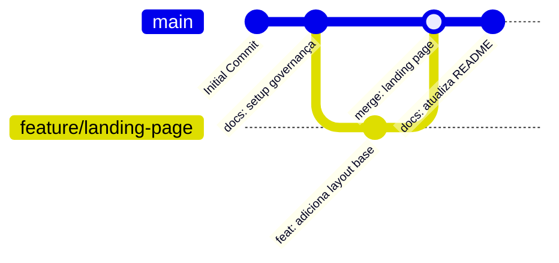

# 🛠️ Estratégia de Execução & Fluxo Git (Olinda Aguiar)

Este documento define o fluxo de trabalho com o Git, padrões de commit, ramificação (branching) e critérios para contribuição e deploy no repositório **Olinda Aguiar — Artes em Madeira** (`fvier/olindaaguiartemadeira`).

---

## 1. Padrão de Branches

| Branch | Finalidade | Regra de Merge |
| :--- | :--- | :--- |
| `main` | Código de produção estável e pronto para deploy | Exige Pull Request (PR) revisado |
| `feature/*` | Desenvolvimento de novas funcionalidades ou módulos | Merge na `main` via PR |
| `fix/*` | Correção de bugs ou falhas identificadas em testes | Merge na `main` via PR |
| `docs/*` | Atualizações de governança, manuais e documentação | Merge direto ou via PR rápido |

---

## 2. Convenção de Commits (Conventional Commits)

Os commits devem seguir o padrão:
`<tipo>(<escopo>): <descrição curta em minúsculas>`

### Tipos Permitidos:
- `feat`: Nova funcionalidade (ex: `feat(catalogo): adiciona vitrine de pecas em madeira`)
- `fix`: Correção de bug (ex: `fix(layout): ajusta responsividade da galeria na versao mobile`)
- `docs`: Alterações na documentação (ex: `docs(diretrizes): atualiza fluxo git`)
- `ci`: Alterações nos workflows do GitHub Actions ou automações de issues
- `refactor`: Refatoração de código sem alterar regra de negócio
- `style`: Ajustes visuais, CSS, tipografia ou cores

---

## 3. Visualização do Git Graph no Terminal

Para visualizar a árvore gráfica de commits e branches diretamente no terminal:

```bash
# Executar comando direto:
git log --graph --oneline --all --decorate

# Ou utilizar o alias oficial configurado:
git graph
```

### Diagrama Mermaid do Fluxo de Trabalho


